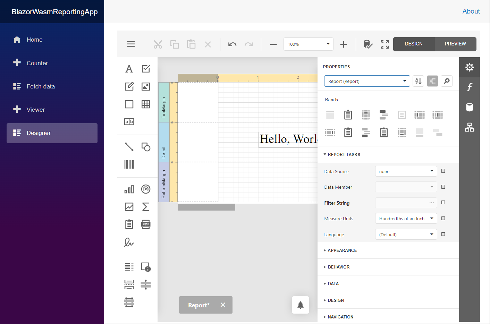

# Reporting for Blazor WASM - Get Started and Create an Application Using Microsoft Template

This application is created with the Microsoft Blazor WebAssembly template, and contains the **Document Viewer** and **Report Designer** JS-Based Reporting controls.

## Files to Review

- [Program.cs](BlazorWasmReportingApp/Server/Program.cs)
- [ReportingControllers.cs](BlazorWasmReportingApp/Server/Controllers/ReportingControllers.cs)
- [Viewer.razor](BlazorWasmReportingApp/Client/Pages/Viewer.razor)
- [Designer.razor](BlazorWasmReportingApp/Client/Pages/Designer.razor)
- [ReportProvider.cs](BlazorWasmReportingApp/Server/ReportProvider.cs)
- [ReportStorage.cs](BlazorWasmReportingApp/Server/ReportStorage.cs)
- [ReportFactory.cs](BlazorWasmReportingApp/Server/ReportFactory.cs)

## Documentation

- [Create a Blazor WebAssembly Reporting Application Using Microsoft Template](https://docs.devexpress.com/XtraReports/404096)

